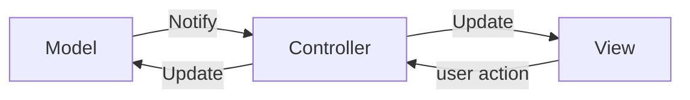
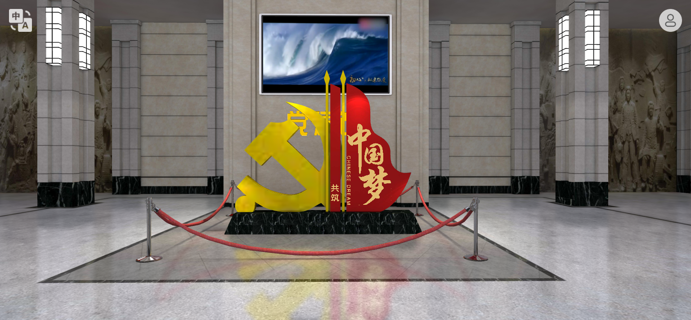

# 数字展馆的MVC架构

## 1. MVC发展史

### 1.1 把视图，数据和逻辑写在一起

要写一个拥有图片和文本的网站要这么写：

```html
<!DOCTYPE html>
<html>
<head>
    <title>My Webpage</title>
</head>
<body>
    <h1>My Webpage</h1>
    
    <p>My Webpage is the best webpage.</p>
</body>
</html>
```

效果：
<h1 id="title">My Webpage</h1>
    
<p id="text">My Webpage is the best webpage.</p>

如果想要修改标题，那么需要在html文件中找到`h1`标签的位置，然后修改中间的文本。

或者在js中执行这样一行代码：

```js
document.getElementById("title").innerHTML = "My Webpage";
```

当然，这有很多弊端。

当html文件庞大起来的时候，可能很难找到h1标签在哪儿。

用js代码我们也未必能够轻易地找到h1的id是什么。

那么自然而然地可以想到把数据和视图分离开来。

创建一个json文件存数据，然后利用js代码把数据渲染到html中。

```js
var data = {
    "title": "My Webpage",
    "image": "myimage.jpg",
    "text": "My Webpage is the best webpage.",
    update: function() {
        document.getElementById("title").innerHTML = data.title;
        document.getElementById("image").src = data.image;
        document.getElementById("text").innerHTML = data.text;
    }
};
```


### 1.2 MVC架构

MVC (Model-View-Controller) 是一种软件设计模式，用于将应用程序的数据模型、用户界面和控制器分离开来。

模型（Model）：数据模型，负责数据的存储和处理。

视图（View）：用户界面，负责展示数据和一些交互的入口。

控制器（Controller）：负责处理用户的输入，然后把数据传递给模型，再把数据传递给视图。

控制器尽量精简，以确保低耦合。



示例代码：

```js
// Model
function Person(name, age) {
  this.name = name;
  this.age = age;
}

// View
function renderPerson(person) {
  console.log(`${person.name} is ${person.age} years old.`);
}

// Controller
function controller(model, view) {
  return {
    updateView: function() {
      view.render(model);
    }
  }
}

// Usage
const person = new Person('John Doe', 30);
const view = renderPerson(person);
const controller = controller(person, view);

// Update the view
controller.updateView();
```

---

## 2. 数字史馆的架构

我们试着用MVC架构来设计数字史馆。

在视图层，我们规定哪儿放什么东西，例如，一进门摆放着一个党章的雕塑：



当然，需求是容易变化的，可能有一天想把这个雕塑换成一个党徽。

所以在视图层，我们不该关心这个雕塑是什么，只需要知道在这里一般会有一个进门`logo`就好。

复习一下[babylon编辑器工作流](./babylon%E7%BC%96%E8%BE%91%E5%99%A8%E5%B7%A5%E4%BD%9C%E6%B5%81.md)这篇文章，我们可以知道，场景里面的`mesh`由`geometry`和`material`,外加一些位置，旋转等信息组成。

那么一个自然而然的想法就是，不改变`mesh`本身，视图层每次动态地加载`model`里的`geometry`和`material`信息，然后渲染到场景中。

当然，现有的游戏引擎里，`mesh`受`geometry`的影响相当大，包括边框盒等等，所以我们不能只改变`geometry`而不该变`mesh`的其它值。

所以提出另一种解决方案：

如果要改变模型，就销毁当前的`mesh`，然后重新创建一个新的`mesh`。

如果只改变材质，那么就只改变`mesh`的`material`属性。

```js
mesh.material = newMaterial;
```

所以接口这样设计：

我们先用一个json文件保存党徽这个`mesh`的基本信息：

```json
{
  "name": "logo",
  "description": "一个放在门口的标志物",
  "uniqueId": "1234567890abcdef",
  "geometry": {
    //是基本类型，球，立方体等等还是自定义的模型
    "type": "custom",
    "path": "logo.obj",
    //用于计算模型是否更改
    "md5": "23343dfezncsd"
  },
  "material": {
    "type": "custom",
    "path": "logo.material",
    "md5": "23343dfmmcvcsd"
  },
  "position": {
    "x": 0,
    "y": 0,
    "z": 0
  },
  "rotation": {
    "x": 0,
    "y": 0,
    "z": 0
  },
  //还有当前mesh的其它所有信息。
}
```

然后`model`要做这几件事情：

- 游戏开始运行时，读取`json`文件初始化一个 ***对象***。

- 写一个函数，用于替换这个mesh（此时把该 ***对象*** 的位置信息等赋值给新`mesh`）。

- 写一个函数，用于更新这个mesh的材质。

- 写一个函数，用于更新这个mesh的位置。

- ......

最后，再写一个`controller`读取`model`里的信息，用于更新视图层。

具体设计细节见`.d.ts`文件。

一些规范：

- 地板用`1*1*0.2`的立方体。
